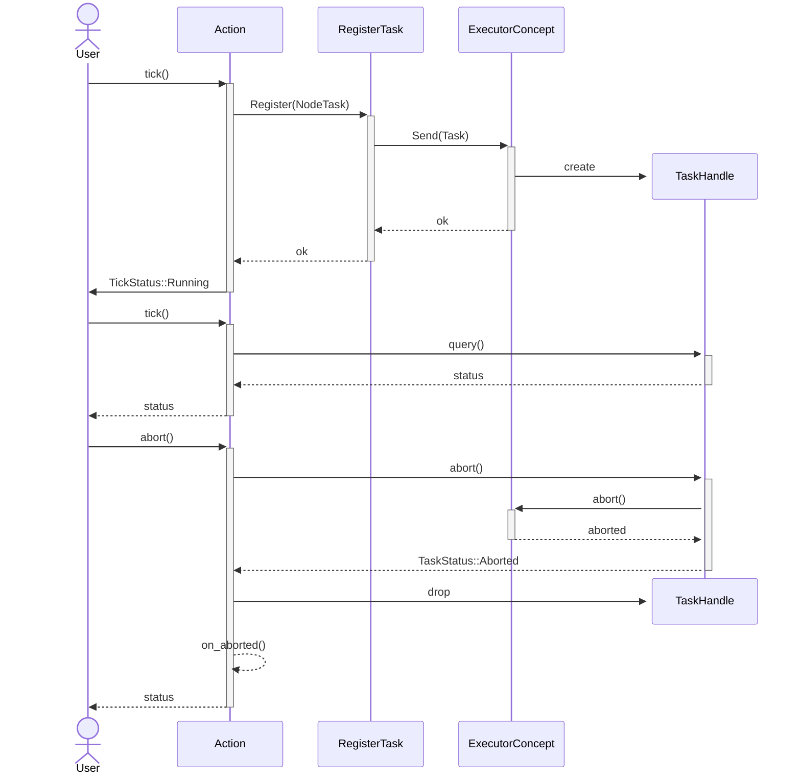

# Execution Model

Beetry executes behavior trees by repeatedly ticking nodes until the tree
reaches a terminal state. Every node participates in the same runtime model,
which keeps execution predictable even when different node kinds have very
different responsibilities.

Execution in Beetry is centered around the `Node` interface. Every executable
node implements the same core lifecycle: it can be ticked, aborted, and reset.
This gives all node kinds a common runtime contract while still allowing them
to behave differently during execution.

This contract is fully synchronous. The tree can execute correctly only if
every node implements it without blocking. If any node blocks during `tick`, it can delay or stall execution of the whole tree.

The result of a tick is described by `TickStatus`:

- `Success` means the node finished successfully
- `Failure` means the node finished unsuccessfully
- `Running` means the node has started work that has not finished yet

## Action Lifecycle

Actions often represent long-running work. That does not fit naturally into
the synchronous `tick` interface, which expects a node to return a result
immediately.

To bridge this gap, Beetry introduces an executor and task registration
interfaces. An action can schedule its work on the executor and obtain a
handle that can later be queried or aborted through the synchronous node
contract.

This allows an action to start work during one tick, return
`Running`, and then report its current state on later ticks
without blocking the tree. In this way, Beetry provides a synchronous runtime
interface over work that is executed asynchronously.

The following sequence shows the high-level interaction between an `Action`,
task registration, the executor, and a task handle.

In practice, this means Beetry can represent long-running work without forcing
users to hide execution state in external systems. A node can begin work, stay
in the running state across multiple ticks, and then either complete normally
or react to being aborted when the tree changes direction.
