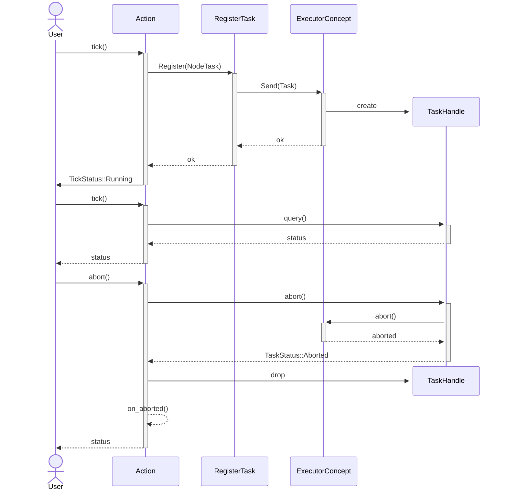

# Execution Model

Beetry executes behavior trees by repeatedly ticking nodes until the tree
reaches a terminal state. Every node participates in the same runtime model,
which keeps execution predictable even when different node kinds have very
different responsibilities.

## What is a tick?

Execution in Beetry is centered around the `Node` interface. Every executable
node implements the same core lifecycle: it can be ticked, aborted, and reset.

`tick` is a single execution step in which the tree asks a node to make
progress and report its current state.  
`reset` clears any execution state so the node or subtree can start again from
a clean state.  
`abort` lets a node stop in-progress work when execution changes direction, for
example when a parent decides that a child should no longer be ticked.  

This gives all node kinds a common runtime contract while still allowing them
to behave differently during execution.

This contract is fully synchronous. The tree can execute correctly only if every
node implements it without blocking. If any node blocks during `tick`, it can
delay or stall execution of the whole tree.

The result of a tick is described by `TickStatus`:

- `Success` means the node finished successfully
- `Failure` means the node finished unsuccessfully
- `Running` means the node has started work that has not finished yet

## When to tick?

Now that the idea of ticking and `TickStatus` is clear, the next question is
when ticks should happen. In many behavior tree systems, the tree is ticked
periodically, for example every 20 ms. In Beetry, the application selects the
ticking policy. Beetry exposes the `Ticker` interface so applications can
define their own tick source, and it provides `PeriodicTick` as one built-in
periodic implementation.

## Action lifecycle

Actions often represent long-running work. That does not fit naturally into
the synchronous `tick` interface, which expects a node to return a result
immediately.

To bridge this gap, Beetry introduces an executor and task registration
interfaces. `Action` implements the `Node` interface, but internally it models
execution via a state machine. On the first `tick`, it uses the
user-provided `ActionBehavior` to create a task and register it with the
executor, which returns a task handle. On later ticks, `Action` uses that
handle to query the task status, or to abort the task if execution changes
direction. Once the task reaches a terminal state, `Action` returns to its
idle state and is ready to create a new task on a later `tick`.

The following sequence shows the high-level interaction between an `Action`,
task registration, the executor, and a task handle.

This approach keeps the node interface synchronous and non-blocking, while
still allowing long-running work to execute in the background. As a result,
multiple leaf nodes can make progress concurrently.
