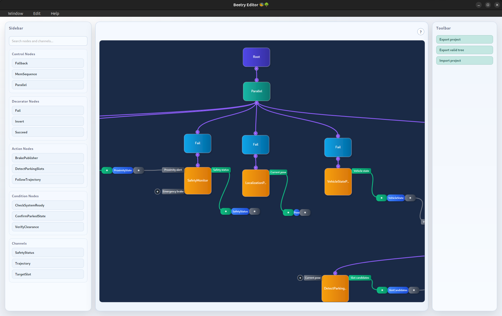

# Editor

As briefly mentioned in the [Defining Tree](./runtime/defining-tree.md)
chapter, realistic behavior trees are usually created in the editor rather
than directly in code.

The following screenshot shows the editor layout at a glance:

## Creating Elements

When designing a tree, the left sidebar shows the elements that can be created.
This includes the available nodes and the messages that can be transported
through channels.

At the top of the sidebar, a search bar can be used to filter the displayed
elements and quickly find the one that is needed.

The following video shows how to navigate the sidebar, create nodes and
channels, and provide node parameters.

<video controls preload="metadata" width="100%">
  <source src="./editor/create_elements.mp4" type="video/mp4">
  Your browser does not support the video tag.
</video>

Node parameters cannot be created with invalid values, so such errors are
detected early rather than at tree execution time.

## Connecting Elements

Connecting nodes is as simple as clicking the output pin of a node and dragging
it to the input pin of its child node.

Explicit inter-node communication is slightly more involved. First, a channel
must be created for the message type that should be transported. Nodes that
define input or output messages then expose corresponding ports. To create a
connection, click a node port and attach it to the appropriate side of the
channel.

This is also shown in the README [demo][readme-demo] video.

## Navigating workspace

As a tree grows, it occupies more space in the workspace. To make this
manageable, the workspace can be panned and zoomed.

In larger trees, channel edges may start to clutter the view. They can be
hidden easily by clicking on them, which is also shown in the video below.

The following video shows basic workspace navigation.

<video controls preload="metadata" width="100%">
  <source src="./editor/navigate.mp4" type="video/mp4">
  Your browser does not support the video tag.
</video>

## Toolbar

On the right side of the editor, there is a toolbar that provides actions for
importing and exporting artifacts.

In the bottom-left corner, an error dialog reports invalid actions. When the
user tries to export a tree, a validation check is performed. If the check
passes, the artifact can be stored. Otherwise, the error dialog shows what is
missing.

This workflow is also demonstrated in the second part of the README
[demo][readme-demo] video.

[readme-demo]: https://github.com/user-attachments/assets/1640300e-9836-462a-af67-8cdbdab43064

For details about the exported data format, see
[Serialization Format](./appendix/artifacts/serialization-format.md).
