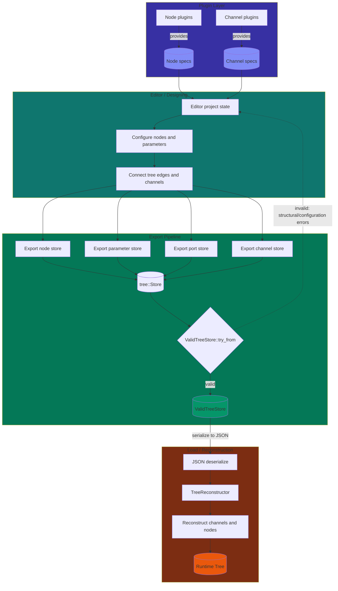

# Pipeline

```mermaid
flowchart TD
    subgraph PluginLayer["Plugin Layer"]
        NP[Node plugins]
        CP[Channel plugins]
        NS[(Node specs)]
        CS[(Channel specs)]
    end

    subgraph EditorLayer["Editor / Designing"]
        E[Editor project state]
        N[Configure nodes and parameters]
        C[Connect tree edges and channels]
    end

    subgraph ExportLayer["Export Pipeline"]
        EN[Export node store]
        EP[Export parameter store]
        EO[Export port store]
        EC[Export channel store]
        TS[(tree::Store)]
        VT{ValidTreeStore::try_from}
        OK[(ValidTreeStore)]
    end

    subgraph RuntimeLayer["Load / Reconstruction"]
        JD[JSON deserialize]
        TR[TreeReconstructor]
        RC[Reconstruct channels and nodes]
        RT[(Runtime Tree)]
    end

    NP -->|provides| NS
    CP -->|provides| CS
    NS --> E
    CS --> E

    E --> N
    N --> C

    C --> EN
    C --> EP
    C --> EO
    C --> EC

    EN --> TS
    EP --> TS
    EO --> TS
    EC --> TS

    TS --> VT
    VT -->|valid| OK
    VT -.->|invalid: structural/configuration errors| E

    OK -->|serialize to JSON| JD
    JD --> TR
    TR --> RC
    RC --> RT

    style PluginLayer fill:#3730a3
    style EditorLayer fill:#0f766e
    style ExportLayer fill:#047857
    style RuntimeLayer fill:#7c2d12
    style NS fill:#818cf8
    style CS fill:#818cf8
    style OK fill:#059669
    style RT fill:#ea580c
```
