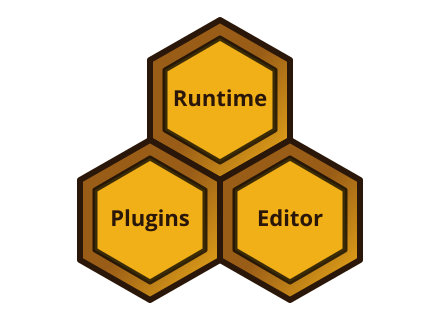

# Introduction

This book assumes a basic knowledge of behavior trees.

The Beetry framework consists of three main components: a runtime, a plugin system, and an editor.

Each of these components provides its own functionality and extends the framework in a different way.

1. The runtime provides the interfaces needed to define and execute a tree.
2. The plugin system makes it possible to define and load trees, including custom tree-related types.
3. The editor allows users to visualize and create trees.

All of these components can work independently, although the editor will most likely be used together with plugins. Knowing which components you need is the first step in deciding which features to enable.

In the following chapters, we take a closer look at each component.

